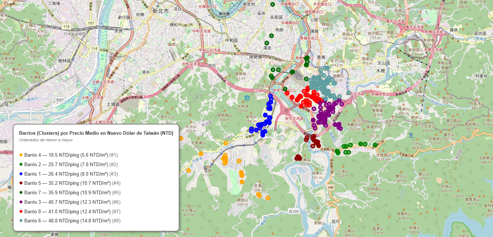
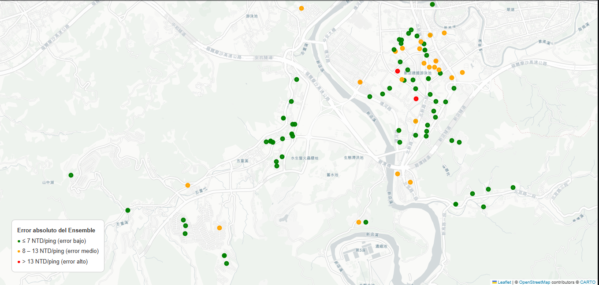

# Real Estate Price Prediction — Sindian, Taiwan

Full end-to-end Machine Learning pipeline to predict the price per unit area (NTD/ping) of residential properties in Sindian, New Taipei City, Taiwan, using the [UCI Real Estate Valuation dataset](https://archive.ics.uci.edu/dataset/477/real+estate+valuation+data+set).

---

## Files

- [Notebook](https://nbviewer.org/github/BabylonFushi/Sindian-Dataset/blob/main/.ipynb)
- [Presentation](https://canva.link/jdzyqvy05zdhny8)

---

## Project Overview

The goal is to build a robust regression model that predicts housing prices from spatial and structural features, and to analyse prediction errors geographically to detect patterns the model may not have captured.

The pipeline covers:

- Data loading directly from UCI repository
- Exploratory data analysis (EDA) and feature distribution
- Outlier detection using Mahalanobis distance and Isolation Forest
- Multicollinearity analysis with VIF
- Feature engineering and preprocessing with Scikit-learn Pipelines
- Comparative evaluation of multiple supervised models with k-fold cross-validation
- Ensemble (VotingRegressor) with hyperparameter tuning via GridSearchCV
- Geospatial residual analysis using Folium interactive maps
- Spatial clustering with DBSCAN and KMeans

---

## Results

| Model | R² (test) | MAE (test) | RMSE (test) | MAPE (test) |
|---|---|---|---|---|
| Linear Regression | 0.6546 | 5.76 | 7.86 | 15.51% |
| Random Forest | 0.6698 | 5.88 | 7.68 | 15.24% |
| Gradient Boosting | 0.7083 | 5.51 | 7.22 | 14.15% |
| SVR | 0.6587 | 5.67 | 7.81 | 15.55% |
| **Ensemble (Voting)** | **0.7122** | **5.32** | **7.17** | **14.24%** |

> The Ensemble explains 71% of price variance with a mean absolute error of 5.32 NTD/ping. The geospatial residual map confirms no systematic geographic pattern in prediction errors, meaning the model is spatially robust.

---

## Spatial Clustering Map

Properties from the dataset are clustered geographically using DBSCAN and KMeans to identify natural groupings in the territory. The interactive map allows exploring how spatial clusters relate to price ranges and proximity to MRT stations.

---

## Geospatial Residual Map

Each point on the map represents a property from the test set. Color indicates the absolute prediction error:

- **Green**: error <= 7 NTD/ping
- **Orange**: error 8–13 NTD/ping
- **Red**: error > 13 NTD/ping

---

## Dataset

**UCI Real Estate Valuation** — Sindian, New Taipei City, Taiwan (2012–2013)

| Feature | Description |
|---|---|
| Transaction Date | Year of sale (decimal format) |
| House Age | Age of the property in years |
| Distance to MRT | Distance to nearest metro station (metres) |
| Number of Stores | Number of convenience stores nearby |
| Latitude / Longitude | Geographic coordinates |
| **House Price of Unit Area** | Target variable (NTD/ping) |

414 records, all numeric, no missing values.

---

## Tech Stack

Python 3.12 — Pandas, NumPy, Scikit-learn, SciPy, Statsmodels, Folium, Matplotlib, Seaborn

---

## Files

| File | Description |
|---|---|
| `notebook.ipynb` | Full pipeline with markdown commentary |
| `mapa_residuos_ensemble.html` | Interactive geospatial residual map |
| `mapa_clusters.html` | Interactive spatial clustering map |
| `requirements.txt` | Python dependencies |

> Note: the notebook and presentation are currently in Spanish.
---

## Author

Rafael Sanchez Clavijo — [rasancla2001new@gmail.com](mailto:rasancla2001new@gmail.com)  
[LinkedIn](https://www.linkedin.com/in/rafael-sanchez-clavijo-3a75a6365) · [GitHub](https://github.com/BabylonFushi)
